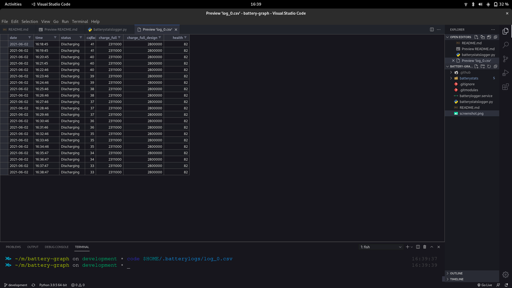

# Battery Graphs 
A small python app for logging the battery percentages, and few other parameters, for later viewing them in a graphical form.

### USAGE
1. Move the `batterylogger.service` to `/lib/systemd/system` 
2. Reload Systemd 
```bash
sudo systemctl daemon-reload
```
3. start service
```bash
sudo systemctl start batterylogger.service
```
4. All data will be collected to `/home/<username>/.batterylogger/log_0.csv`

### Screenshot of working

